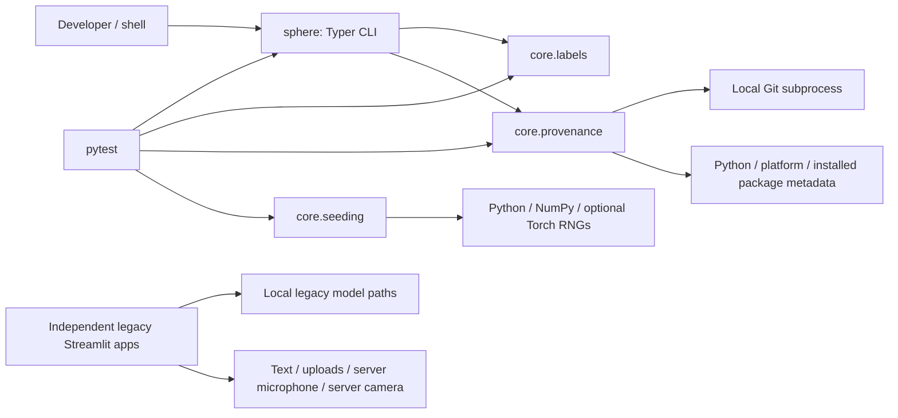

# Project Bible

> **Active upgrade, 2026-09-10:** The user authorized Phases 1–8, plan corrections,
> and a public demo. Phase 0 was complete at the snapshot below. New work has begun
> on shared validated configuration/inference contracts, atomic artifact I/O, and
> the evaluation/data harness. The negative-index, short-SHA, zero-chunk hash, and
> untracked-source provenance defects are being repaired. Until the next full
> refresh, implementation and the execution ledger in `UPGRADE_PLAN.md` supersede
> the historical snapshot below. GPU connection details and HF Space identity are
> pending; no model result or deployment has yet been claimed.

Technical reference for the repository inspected on **2026-09-10**, at commit
`511cf5dd758b3e104124f204a48df864d9841dea`. This describes the working tree at that
revision, including separately identified local, ignored data and artifacts.

**Evidence rule:** executable source and configuration establish current behavior;
notebook source and saved text outputs establish what those notebooks contain;
`docs/audit.md` records a historical investigation; `UPGRADE_PLAN.md` specifies
future work. These sources sometimes disagree. Historical measurements are not
newly reproduced measurements, and proposed interfaces are not implemented APIs.
Notebook cell references below use **zero-based indices in the notebook JSON**.

## 1. Executive Summary

SentimentSphere is a Python emotion-recognition research/portfolio project covering
text, speech, and facial expressions. It is undergoing a v2 rebuild of a coursework
implementation. The intended destination is calibrated multimodal inference with
a public demo, reproducible evaluation, and traceable artifacts. The present v2
package is a foundation, not a working multimodal prediction service.

Current capability is established by `src/sentimentsphere/cli.py` and the three
implementation files in `src/sentimentsphere/core/`:

| Capability | Current status |
|---|---|
| Canonical seven-emotion vocabulary and eight dataset/source mappings | Implemented and unit tested |
| Python/NumPy seeding, optional PyTorch/CUDA determinism controls | Implemented; GPU behavior not validated in this inspection |
| Git/environment provenance and configuration/file hashes | Implemented, with edge cases documented in §20 |
| CLI help, version, label tables, environment information | Implemented |
| Dataset downloads, frozen splits, evaluation, training, prediction, serving | CLI stubs or empty packages |
| Gradio demo, Docker image, FastAPI HTTP API, fusion | Planned; implementation absent |
| Original prediction applications | Four archived Streamlit scripts; independent, fragile, and not maintained |

There is **no application database, authentication system, REST service, frontend
JavaScript application, or implemented fusion pipeline** in this tree. The archived
apps execute model calls inside the Streamlit server process. They do not call the
v2 package or a separate backend. See `legacy/v1/README.md`, the app source, and the
docstring-only v2 `serving`, `inference`, and `models` packages.

## 2. Repository Structure

### 2.1 Inventory and responsibilities

The inspected revision contains 63 tracked files. The meaningful tree is:

```text
.
├── PROJECT_BIBLE.md                  This reference (added by this inspection)
├── README.md                         Provisional v2 status and quickstart
├── UPGRADE_PLAN.md                    Historical audit + proposed phases 0–9
├── LICENSE                           MIT source license and third-party notices
├── pyproject.toml                    Packaging, dependency extras, tool settings
├── uv.lock                           Resolved dependency graph
├── Makefile                          Setup, quality gates, future workflow targets
├── .env.example                      Credential/path template; no active loader
├── .gitignore                        Data/artifact/secret/cache exclusions
├── .gitattributes                    LF defaults, binary handling, legacy preservation
├── .pre-commit-config.yaml           Formatting, typing, hygiene hooks
├── .github/workflows/ci.yml          Quality, hygiene, and pre-commit jobs
├── .devcontainer/devcontainer.json   Python 3.12 development container
├── src/sentimentsphere/
│   ├── __init__.py                   Version and public label exports
│   ├── cli.py                        Typer command registration and dispatch
│   ├── core/
│   │   ├── __init__.py               Public convenience exports
│   │   ├── labels.py                 Emotion enum, source maps, conversion helpers
│   │   ├── provenance.py             Git, package metadata, hashes, Provenance
│   │   └── seeding.py                SeedReport, RNG/backend setup, worker seeding
│   ├── data/__init__.py              Placeholder: loaders and splits
│   ├── eval/__init__.py              Placeholder: metrics/calibration/reports
│   ├── inference/__init__.py         Placeholder: predictors/ONNX/pipeline
│   ├── models/__init__.py            Placeholder: modality and fusion models
│   ├── serving/__init__.py           Placeholder: FastAPI and schemas
│   └── training/__init__.py          Placeholder: training loops/callbacks/sweeps
├── configs/{text,audio,vision,fusion}/  Each contains only .gitkeep
├── apps/space/                       Only .gitkeep; no app.py or Dockerfile
├── data/raw/
│   ├── .gitkeep
│   ├── text_emotion_aggregate.csv    Tracked data exception
│   └── tess/                        Local ignored WAV corpus, not in a fresh clone
├── artifacts/v1/                    Four local ignored legacy model binaries
├── reports/                         Only tracked .gitkeep
├── notebooks/                       Only .gitkeep; future EDA location
├── docs/audit.md                     Historical findings of record
├── tests/
│   ├── unit/{test_cli,test_core,test_labels}.py
│   └── {integration,golden,fixtures}/  Each contains only .gitkeep
└── legacy/v1/
    ├── README.md
    ├── text/
    │   ├── app_streamlit.py
    │   ├── app_streamlit_older.py
    │   └── notebooks/
    │       ├── bilstm_glove200d_8class.ipynb
    │       ├── bilstm_glove300d_7class.ipynb
    │       └── bilstm_best_val0593.ipynb
    ├── speech/
    │   ├── app_streamlit_conv1d.py
    │   ├── nbconvert_not_an_app.py
    │   ├── requirements.txt
    │   ├── notebooks/
    │   │   ├── conv1d_ravdess_savee_thirdparty.ipynb
    │   │   └── tess_lstm_100pct_LEAKED.ipynb
    │   └── test_audios/              Eight tracked WAV examples
    └── vision/
        ├── app_streamlit.py
        ├── haarcascade_frontalface_default.xml
        ├── Visual_Emotion_Recognition_report.pdf
        └── notebooks/cnn_fer2013_died_epoch12.ipynb
```

The eight WAV examples pair female/male names for angry, calm, fearful, and happy.
They are legacy examples; no current test loads them. Empty `.agents/` and `.codex/`
directories and a local `.claude/settings.local.json` were also present. No
applicable `AGENTS.md` was found in the repository or its ancestor directories.

### 2.2 Inspection scope and intentional exclusions

Inspected all maintained Python and tests, all five archived Python scripts, all
six notebooks' source cells, relevant saved textual notebook evidence, all tracked
configuration/documentation, the lockfile's metadata/dependency graph, the CSV's
schema and aggregate contents, and the cascade XML's license/header/structure.
Exact duplicate notebook cells were compared programmatically and read once.
The ten-page PDF's text was extracted and read because it is a substantive report.

Intentionally excluded from indiscriminate content reading:

| Material | Treatment and reason |
|---|---|
| `.git/` internals and historical object payloads | Used Git for inventory, revision, and status; did not traverse object binaries or alter history |
| `.venv/`, `.mypy_cache/`, `.pytest_cache/`, `.ruff_cache/`, `__pycache__/` | Dependency and generated cache contents excluded; existing tool executables used for validation |
| `data/raw/tess/.DS_Store` | Local macOS metadata; identified during the second inventory pass and not opened |
| WAV corpus and eight demo WAVs | Enumerated filenames/counts; did not decode/listen to binary audio |
| `artifacts/v1/*.pkl`, `*.h5` | Recorded filenames and byte sizes; did not deserialize, execute, or inspect weight arrays |
| Notebook images, embedded audio/HTML, long repetitive training outputs | Skipped binary/base64 presentation content; extracted relevant text, shapes, metrics, and warnings |
| Cascade classifier numeric tables | Parsed structural metadata, skipped trained weak-classifier coefficient tables; app does not use this copy |
| PDF images/graphs | Read extracted report text; did not claim visual verification of embedded architecture diagrams |
| `.env`, credential files, private keys, personal agent settings | No secret values sought or copied; `.env.example` inspected. `.claude/settings.local.json` treated as private local agent configuration |
| Lockfile wheel URLs and repeated distribution hashes | Parsed lock metadata and package entries; did not recite generated package-download records |

No training, downloads, installations, model deserialization, hosted inference,
device capture, publishing, or deployment was performed. No external service
availability or current upstream dependency/security status was verified.

## 3. Technology Stack

| Area | Repository evidence and role |
|---|---|
| Runtime | Python `>=3.11,<3.13` in `pyproject.toml`; inspected local environment is Python 3.12.14 |
| Packaging | Hatchling build backend, `src` layout, uv dependency management; version `2.0.0.dev0` |
| Current CLI | Typer commands and Rich tables/JSON in `cli.py` |
| Current primitives | NumPy; Python dataclasses, `StrEnum`, hashing, subprocess, package metadata |
| Declared scientific stack | pandas, SciPy, scikit-learn, joblib; mostly awaiting v2 data/model implementation |
| Proposed model stack | PyTorch, Transformers, modality-specific extras; no current v2 model implementations |
| Proposed serving/demo | FastAPI, Uvicorn, Pydantic, ONNX Runtime, Gradio; dependencies and roadmap only |
| Archived UI | Streamlit, Altair, matplotlib, pandas, custom embedded CSS |
| Archived inference/training | scikit-learn/joblib text pipeline; Keras/TensorFlow LSTM/CNNs; librosa; OpenCV; PyAudio |
| Quality | pytest, pytest-cov, Ruff, mypy, pre-commit, nbstripout |
| Infrastructure | GitHub Actions CI and a devcontainer; HF Spaces/Hub and GPU training host are roadmap destinations |
| Documentation | Markdown and a PDF report; MkDocs tooling declared, site configuration absent |

There are no Node/package.json assets, ORM/database dependencies in application
code, SQL schemas, migrations, Docker Compose files, application Dockerfiles,
Kubernetes manifests, or infrastructure-as-code modules.

## 4. Architecture

### 4.1 Implemented architecture



`sphere` resolves to `sentimentsphere.cli:app` through `[project.scripts]` in
`pyproject.toml`. CLI handlers import labels and provenance from `core`; package
initializers expose convenience imports. Importing `core` also imports `seeding`
and therefore NumPy. Heavy Torch import is delayed until seeding is requested.
The label module itself uses only the standard library.

The current app has no dependency injection container, service registry, plugin
system, asynchronous job queue, RPC boundary, or persistence layer. Composition is
ordinary imports plus module-level command registration. `Emotion` inherits
`StrEnum`; `UnknownLabelError` inherits `KeyError`; provenance and seed reports are
frozen dataclasses. Legacy Keras models compose sequential layers, not project
model base classes.

### 4.2 Planned architecture, explicitly not implemented

`UPGRADE_PLAN.md` §§II.2–II.4 and Phases 1–8 propose dataset loaders and frozen
splits → baseline evaluation → modality models → probability calibration → late
fusion → ONNX predictors → FastAPI and Gradio. Text targets DeBERTa-v3; speech
targets WavLM; vision targets ConvNeXt/ViT and aligned face crops; MELD supplies
paired modalities for fusion. These are proposed model choices, not loaded models.

The plan sketches an `EmotionModel(Protocol)` with `labels`,
`predict_proba(x) -> (n, 7)` probabilities, and `to_onnx(path)`. That protocol,
`Batch`, a predictor abstraction, a configuration model, and registry do not exist
in `src`. The only implemented part of that cross-modality contract is the label
vocabulary. Calibration, probability validation, missing-modality handling,
preprocessing ownership, and artifact stamping are goals awaiting consumers.

### 4.3 External integration boundaries

Current v2 CLI/library operations do not call network services. The integrations
found in source and configuration have distinct scopes:

| Integration | Caller/evidence | Status and data exchanged |
|---|---|---|
| Stanford GloVe download | Text notebook shell cells: 200d cell 98, 300d cell 104, best-run cell 102 | Active archived `wget`/unzip commands obtain `glove.6B.zip`; no checksum verification in those cells |
| NLTK resource downloads | Text notebook import/normalization cells, including 200d cells 2 and 61 | Fetch stopword/lexical resources when executed; required by notebook cleaning functions |
| Google Drive / Colab | 300d and best-run text notebooks, `drive.mount()` and checkpoint callbacks | Mount Drive and read/write model checkpoints and training CSV logs; not available as a normal local filesystem contract |
| Kaggle | TESS notebook cells 4–7, `.env.example`, roadmap | Notebook setup/download commands are commented out; future FER loader absent |
| PyPI and GitHub hook repositories | `uv.lock`, `.pre-commit-config.yaml`, CI | Installation/tooling dependencies; not runtime prediction integrations |
| Hugging Face Hub / Spaces | Manifest extras/core dependencies, `.env.example`, roadmap | Intended weight/data hosting and public demo; no current download client call, repo ID, or deploy workflow |
| W&B | `track` extra and `.env.example` | Intended training telemetry; no initialized client or transmitted experiment records |

Historical notebook badges link to a different account's fork; they are navigation
metadata, not evidence of a deployed service or a runtime dependency. See
`docs/audit.md` §6 and the notebooks' first markdown cells.

## 5. Application Flow

### 5.1 Inspect labels

1. Shell invokes `sphere labels`, optionally `--source tess`.
2. Typer calls `cli.py:labels_cmd(source)`.
3. With no source, the handler enumerates `labels.CANONICAL`, lists source keys,
   and prints `EXCLUSION_REASONS` through Rich.
4. With a source, it checks exact membership in `SOURCE_MAPS`, sorts raw keys,
   and prints canonical labels plus `to_index()` results. Exclusions show a dash.
5. An unknown source prints a message and exits 1. No dataset or model is loaded.

For programmatic loading, the separate path is raw dataset label →
`labels.normalize(raw, source)` → `Emotion` or deliberate `None` → `to_index()`.
No v2 dataset loader currently calls this path.

### 5.2 Inspect provenance

1. `sphere info [--json]` dispatches to `cli.py:info()`.
2. `provenance.collect()` gathers SHA, tracked-file dirtiness, Python/platform,
   and versions of a fixed package allowlist. No config is passed by this handler.
3. `_git()` runs Git from the source module's directory, with a five-second
   timeout per subprocess; failures become `None`.
4. `Provenance.to_dict()` uses `dataclasses.asdict()`.
5. JSON mode emits that dictionary. Table mode additionally displays the project
   version and a warning for dirty tracked files. Nothing is written to reports.

### 5.3 Seed a future experiment

Caller → `seed_everything(seed=1337, deterministic=True)` → compare/set
`PYTHONHASHSEED` environment value → seed `random` and global NumPy RNG → optionally
import and seed Torch/CUDA → configure deterministic backends when requested →
return `SeedReport`. `worker_init_fn(worker_id)` separately derives seeds from
`torch.initial_seed()` for DataLoader workers. No current training/evaluation
command calls either helper. Report limitations are in §20.

### 5.4 Invoke an unimplemented command

`sphere data`, `eval`, `train`, `predict`, or `serve` → corresponding handler →
`_pending(command, phase)` → phase/roadmap message → exit 2. The handlers accept no
business options yet. Consequently, `sphere eval --baseline --all` and
`sphere train --config ...` fail in Typer option parsing before `_pending()` runs.
Those forms appear in Make targets, but are not functional workflows.

### 5.5 Legacy text analysis

`legacy/v1/text/app_streamlit.py` import → construct script-relative
`model/text_emotion.pkl` path → `joblib.load()` into global `pipe_lr` → `main()` →
Streamlit form `emotionForm` → `raw_text` and submit button →
`predict_emotions(raw_text)` calls `pipe_lr.predict([docx])` →
`get_prediction_proba(raw_text)` separately calls `predict_proba([docx])` → display
text, label/emoji, maximum probability, and an Altair bar chart using
`pipe_lr.classes_` as column order.

`app_streamlit_older.py` uses the same two helper functions and artifact path, with
form `my_form`, literal `"."` emoji values, and direct dictionary indexing.
Neither validates empty input, cleans text with neattext, or caches model loading.
The expected model path is absent in the present tree; the local ignored artifact
has a different location/name (§9). These are source traces, not successful live
app runs. The audit identifies the artifact as CountVectorizer + LogisticRegression;
that identity was not re-established by deserializing it during this task.

### 5.6 Legacy uploaded/recorded speech

`legacy/v1/speech/app_streamlit_conv1d.py:main()` → cached `load_model()` → build
Conv1D model and attempt CWD-relative weights load. The function returns even if
the file is absent or loading raises an exception.

Upload tab: `st.file_uploader()` accepts WAV/MP3 → write bytes to a timestamp-named
`.wav` file → `display_waveform()` and `st.audio()` → Analyze button →
`predict_emotion(file_path, model)` → `extract_feature()` → model probabilities →
hardcoded ten-label argmax → split gender/emotion string → two metrics and chart →
remove file on the success path.

Record tab: Start button → `record_audio(duration=4, filename=...)` → PyAudio
captures the **server** input device at 44.1 kHz, stereo, 16-bit → write WAV → same
waveform/inference/display/cleanup path. There is no browser microphone transport.

Feature contract: `librosa.load(..., sr=44100, duration=2.5, offset=0.5,
res_type='kaiser_fast')`; pad/truncate waveform to 110,250 samples; compute 13 MFCCs;
mean over coefficient axis (`axis=0`, retaining a time series); pad/truncate to
216 values; DataFrame conversion and `expand_dims(axis=2)` produce `(1,216,1)`.
The classifier returns ten probabilities, not the v2 canonical seven.

### 5.7 Legacy camera processing

`legacy/v1/vision/app_streamlit.py` top-level initialization → cached
`load_resources()` loads CWD-relative `model.h5` and the **OpenCV-installed** cascade
→ store resources and labels in `st.session_state` → Start button sets `running`
→ `process_video()` opens `cv2.VideoCapture(0)` on the server → request 640×480 →
frame loop flips and grayscales frame → `detectMultiScale(gray, 1.1, 5)` → each face
crop resized to 48×48 and scaled `/255.0` → `(1,48,48,1)` model input → argmax decoded
through session labels → update `current_emotion`, draw box/text, update Streamlit
image/result/bar chart → sleep 0.1 s. Loop exit releases capture and clears widgets.

The result panel reflects the last processed face, not an aggregate of faces.
Frames without a face do not clear the previous emotion/chart inside the loop.
Stop sets `running=False` in a later top-level branch; responsiveness under
Streamlit reruns requires runtime investigation. There is no temporal smoothing.

### 5.8 Archived training paths

| Notebook/script | Actual path and important distinctions |
|---|---|
| `legacy/v1/text/notebooks/bilstm_glove200d_8class.ipynb` | CSV → two stratified `train_test_split(..., random_state=42)` calls (initial 64/16/20 train/val/test) → duplicate/conflict handling within splits → `normalize_text()` → remove normalized-text overlaps with assertions → LabelEncoder/one-hot → tokenizer fitted on **train + test** (cell 82) → 631-token padding → frozen GloVe 200d → BiLSTM 256/128/128 → Dense(8) → ten-epoch fit with EarlyStopping. Its active source has no checkpoint writer. |
| `legacy/v1/text/notebooks/bilstm_glove300d_7class.ipynb` | Similar cleanup, with `keep_majority_emotion()` and explicit shame removal → training-only tokenizer, 15,000-word cap (fitted twice) → character-derived `maxlen` → GloVe 300d → masked frozen embedding → BiLSTM 128/64 → Dense(64), dropout, Dense(7). Includes Drive resume and training/checkpoint cells. |
| `legacy/v1/text/notebooks/bilstm_best_val0593.ipynb` | Name/audit suggest BiLSTM/seven classes, but active cell 109 builds frozen GloVe **200d**, single **LSTM(128)**, Dense(64), dropout, **Dense(8)**. Cell 111 saved output confirms eight-column labels. Tokenizer cap is 10,000 while embedding allocation cap is 15,000. Contains Drive resume cell 108 and fresh fit cell 114; source order depends on existing checkpoints. |
| `legacy/v1/speech/notebooks/conv1d_ravdess_savee_thirdparty.ipynb` | `RawData/` names → gender/emotion parsing by filename slices → filtered 216-step mean-MFCC features → shuffle → unseeded random 80/20 mask → separate LabelEncoder `fit_transform()` calls on train/test → Conv1D starting at **256** channels → Dense(10) → cell 42 still contains 700-epoch fit, with no saved outputs → save H5/JSON → reload/evaluate → export `Predictions.csv` → live WAV example. |
| `legacy/v1/speech/notebooks/tess_lstm_100pct_LEAKED.ipynb` | Unsorted recursive `tess_data` walk → DataFrame(`speech`,`label`) → `extract_mfcc()` averages 40 coefficients over time → `(N,40,1)` → one-hot seven labels → LSTM(256), Dense(128/64/7), dropout → `fit(validation_split=0.2, epochs=50, batch_size=64)`. Saved outputs show **5,600**, not 2,800, examples and perfect late train/validation accuracy. No speaker-group split or model-save call is present. |
| `legacy/v1/speech/nbconvert_not_an_app.py` | Same TESS-style EDA/MFCC/LSTM training sequence as top-level script, with a 2,800-file early break after a directory. It is not Streamlit and expects absent `tess_data/`. With no data, its pre-training EDA indexes empty selections; earlier plotting may also fail. |
| `legacy/v1/vision/notebooks/cnn_fer2013_died_epoch12.ipynb` | `images/train` and `images/validation` → grayscale directory generators, batch 128, no augmentation/rescaling configured → CNN 64/128/512/512 with BatchNorm/pooling/dropout → Dense 256/512/7 → compile and recompile → fit with floor-divided steps and callbacks. Saved output contains generator exhaustion and invalid monitor warnings, then **early stopping at epoch 12**. |

Notebook source/output order is historical evidence, not a guarantee that running
all cells from a clean kernel reproduces saved metrics. In particular, text resume
cells can load a previous Drive model before later cells construct a new model.

## 6. Core Modules

### 6.1 Labels: `src/sentimentsphere/core/labels.py`

`Emotion` defines the canonical string enum. `CANONICAL` is its declaration-order
tuple; `NUM_CLASSES` is seven; `INDEX` is the inverse mapping. `SOURCE_MAPS` owns raw
vocabularies. `EXCLUSION_REASONS` records why an otherwise recognized label is
removed. `Final` annotations signal intended stability, but dictionaries remain
mutable at runtime.

`normalize()` requires an exact registered source name, strips/lowercases **raw
labels only**, returns an enum or `None`, and raises `UnknownLabelError` for unknown
source/label. `to_index()` expects canonical values, not aliases. `from_index()`
uses Python tuple indexing and currently accepts negative indices. `excluded_labels()`
returns sorted excluded raw names; an unknown source raises a plain `KeyError`.

### 6.2 Provenance: `src/sentimentsphere/core/provenance.py`

`_git()` centralizes subprocess timeout/error handling. `git_is_dirty()` ignores
untracked files deliberately. `hash_config()` JSON-serializes with sorted keys,
compact separators, and `default=str`; `hash_file()` streams one-MiB chunks by
default. Both return the first **16 hex characters** of SHA-256, not a full digest.
`collect(config=None, **extra)` creates `Provenance`; callers must supply any split
hash, seed report, or dataset checksum in `extra`. Nothing automatically attaches
provenance to model files or enforces clean-tree publication.

`_TRACKED_PACKAGES` is exactly numpy, pandas, scikit-learn, torch, transformers,
librosa, onnxruntime, tensorflow. Missing distributions are omitted, rather than
reported as missing. This is not a complete dependency inventory; notably the
manifest declares `tensorflow-cpu`, and provenance looks up `tensorflow` by name.

### 6.3 Seeding: `src/sentimentsphere/core/seeding.py`

`DEFAULT_SEED=1337`. `seed_everything()` seeds Python/global NumPy, optionally
Torch and all CUDA devices, and returns actual reachability flags. With
`deterministic=True` it sets cuDNN deterministic mode, disables cuDNN benchmarking,
uses `CUBLAS_WORKSPACE_CONFIG=:4096:8` only if unset, and requests Torch deterministic
algorithms with `warn_only=True`. This is a best-effort control, not a proof of
bitwise reproducibility. `deterministic=False` does not reset earlier backend flags.

`worker_init_fn()` requires Torch even though top-level import does not. It computes
`base = torch.initial_seed() % 2**32`, then seeds NumPy/Python with `base + worker_id`.
Its edge cases and absence of tests are in §20.

### 6.4 Public imports and stubs

`src/sentimentsphere/__init__.py` exports `CANONICAL`, `NUM_CLASSES`, `Emotion`, and
`__version__`. `core/__init__.py` additionally exposes label conversion/error types,
provenance helpers, default seed and `seed_everything()`. `worker_init_fn()` and
`excluded_labels()` are accessed through their defining modules rather than those
convenience exports. The six remaining packages contain only phase docstrings;
they have no hidden controllers, models, schemas, or algorithms.

## 7. Important Files

| File | Why a change matters |
|---|---|
| `src/sentimentsphere/core/labels.py` | Defines semantic identity and output index meaning; changes require all maps/tests and future artifact decoders to agree |
| `src/sentimentsphere/core/provenance.py` | Defines how results identify code/config/data; hash changes invalidate comparisons |
| `src/sentimentsphere/core/seeding.py` | Changes experiment reproducibility and process-global RNG/backend behavior |
| `src/sentimentsphere/cli.py` | User-facing command/option/exit-code contract; Make, README, CI, and tests depend on it |
| `pyproject.toml` | Runtime support, package exports, extras, build boundaries, and lint/type/test rules |
| `uv.lock` | Resolved versions and platform/Python branches; needed to understand actual environments |
| `Makefile` | Maintainer entry points, determinism environment, and placeholders that expose missing work |
| `.github/workflows/ci.yml` | Actual enforced checks; differs from aspirational CI described in roadmap |
| `.pre-commit-config.yaml` and `.gitattributes` | Protect legacy bytes and constrain repository growth; hooks can rewrite maintained files |
| `data/raw/text_emotion_aggregate.csv` | Tracked source data exception; row order, text, and labels affect any reproduced split/metric |
| `docs/audit.md` and `UPGRADE_PLAN.md` | Explain motivation and intended direction; require the corrections/qualifications in §20 |
| `legacy/v1/README.md` and six archived notebooks | Artifact/training history, known inconsistencies, and original evidence |

## 8. APIs

### 8.1 Implemented CLI surface

All commands are local and require no application authentication.

| Invocation | Handler in `src/sentimentsphere/cli.py` | Output / exit |
|---|---|---|
| `sphere --help` | Typer `app` | Help, exit 0; completion disabled; no-argument help configured |
| `sphere version` | `version()` | `2.0.0.dev0`, exit 0 |
| `sphere labels` | `labels_cmd()` | Canonical table, sources, exclusions, exit 0 |
| `sphere labels --source SOURCE` | `labels_cmd(source)` | Source table, exit 0; unknown source exit 1 |
| `sphere info` | `info()` | Provenance table, exit 0 |
| `sphere info --json` | `info(as_json=True)` | Serialized Provenance, exit 0; no top-level project-version field |
| `sphere data` / `sphere eval` | `data_cmd()` / `eval_cmd()` | Phase 1 notice, exit 2 |
| `sphere train` | `train_cmd()` | Phases 2–4 notice, exit 2 |
| `sphere predict` / `sphere serve` | `predict_cmd()` / `serve()` | Phase 6 notice, exit 2 |

The module also supports `python -m sentimentsphere.cli`. There is no
`sentimentsphere/__main__.py` implementing `python -m sentimentsphere`.

### 8.2 Programmatic API

| Defining module | Interface | Result/error behavior |
|---|---|---|
| `core/labels.py` | `normalize(raw: str, source: str) -> Emotion \| None` | Known exclusions return None; unknown vocabulary raises `UnknownLabelError` |
| `core/labels.py` | `to_index(label: str \| Emotion) -> int` | Canonical lookup; `UnknownLabelError` on unknown string |
| `core/labels.py` | `from_index(index: int) -> Emotion` | Tuple lookup; bounds failure reworded as `IndexError`; negative-index caveat |
| `core/labels.py` | `excluded_labels(source: str) -> tuple[str, ...]` | Sorted exclusions; plain `KeyError` for bad source |
| `core/provenance.py` | `collect(config: Any \| None = None, **extra) -> Provenance` | Read-only snapshot; Git unknowns allowed |
| `core/provenance.py` | `hash_config(config)`, `hash_file(path, chunk_size=1<<20)` | 16-character digest; file errors propagate |
| `core/provenance.py` | `git_sha(short=False)`, `git_is_dirty()` | String/bool or None; short-SHA bug in §20 |
| `core/seeding.py` | `seed_everything(seed=1337, *, deterministic=True) -> SeedReport` | Mutates process-global state; optional Torch |
| `core/seeding.py` | `worker_init_fn(worker_id: int) -> None` | Torch-dependent worker callback |

### 8.3 HTTP surface

**No HTTP routes are implemented.** The roadmap's Phase 6 proposes
`POST /v1/predict/text`, `/v1/predict/audio`, `/v1/predict/image`,
`/v1/predict/video`, `GET /healthz`, and `GET /v1/models`. Request payloads, response
schemas, status codes, validation limits, auth requirements, CORS, and versioning
policy are **Unknown / requires investigation**. There is no OpenAPI document or
FastAPI application object to infer those contracts from. Streamlit's own transport
is framework-managed and is not a repository-defined REST API.

## 9. Data Model

### 9.1 No database

Persistence is file-based: input CSV/WAV/images, model artifacts, notebook outputs,
and legacy temporary files. No tables, migrations, ORM entities, relationships,
database credentials, user records, or persisted sessions exist. Model here usually
means a machine-learning estimator, not a database entity.

### 9.2 Canonical label data

| Index | Canonical value |
|---|---|
| 0 | anger |
| 1 | disgust |
| 2 | fear |
| 3 | joy |
| 4 | neutral |
| 5 | sadness |
| 6 | surprise |

Source vocabularies in `labels.py`:

| Source key | Mapping |
|---|---|
| `text_aggregate` | Canonical names unchanged; `shame → None` |
| `tess` | `angry→anger`, `disgust→disgust`, `fear→fear`, `happy→joy`, `neutral→neutral`, `ps→surprise`, `sad→sadness` |
| `ravdess` | `01/02→neutral`, `03→joy`, `04→sadness`, `05→anger`, `06→fear`, `07→disgust`, `08→surprise`; aliases `neutral`, `calm`, `happy`, `sad`, `angry`, `fearful`, `disgust`, `surprised` |
| `crema_d` | `ang→anger`, `dis→disgust`, `fea→fear`, `hap→joy`, `neu→neutral`, `sad→sadness`; no surprise |
| `savee` | `a→anger`, `d→disgust`, `f→fear`, `h→joy`, `n→neutral`, `sa→sadness`, `su→surprise` |
| `fer2013` | `angry`, `disgust`, `fear`, `happy`, `neutral`, `sad`, `surprise` mapped to corresponding canonical names |
| `meld` | Seven canonical names unchanged |
| `v1_speech_conv1d` | Explicit `female_` and `male_` forms of angry/calm/fearful/happy/sad → anger/neutral/fear/joy/sadness; no disgust or surprise |

The v1 gender removal is a fixed ten-key map, not a general prefix-stripping
algorithm. `pleasant_surprise` mentioned in the roadmap is **not** a TESS alias in
current code. Maps translate labels only; they do not aggregate/reorder a ten-way
probability vector into seven classes. A future baseline adapter must implement
that separate operation.

### 9.3 Tracked text dataset

`data/raw/text_emotion_aggregate.csv` has fields `Emotion` and `Text`; there is no
ID, source-corpus field, timestamp, split assignment, or speaker field. A read-only
CSV scan during this inspection found:

| Label | Rows |
|---|---|
| joy | 11,045 |
| sadness | 6,722 |
| fear | 5,410 |
| anger | 4,297 |
| surprise | 4,062 |
| neutral | 2,254 |
| disgust | 856 |
| shame | 146 |
| **Total** | **34,792** |

Both fields were nonempty in every parsed row. There are **31,110 distinct raw
texts**, **3,630 duplicate rows beyond the first identical `(Emotion, Text)` pair**,
and **50 distinct raw texts with multiple labels**. These use exact strings before
normalization. The audit's 1,662 duplicate-row figure does not match this current
full-file calculation; its calculation scope is unknown. Dropping only shame
leaves 34,646 rows before deduplication or any other filtering.

Legacy notebooks use pandas DataFrames and split-local cleanup. Their normalization
can change text and remove short examples; raw counts do not describe the final
training population. No committed split manifests or reproducible current baseline
report are present.

### 9.4 Local audio and artifacts

The ignored local `data/raw/tess/` contains 2,800 WAV filenames, 400 per raw emotion.
Prefix counts are `OAF:1399`, `YAF:1400`, and **`OA:1`**. These are filename counts,
not verified speaker identities. A loader must investigate the anomalous `OA`
prefix rather than silently treating it as a third speaker or rewriting it.

Local ignored artifact inventory (bytes from filesystem metadata):

| File under `artifacts/v1/` | Bytes | Historical description from `docs/audit.md` / `legacy/v1/README.md` |
|---|---:|---|
| `v1_text_countvec_lr.pkl` | 2,015,736 | CountVectorizer + LogisticRegression, eight classes |
| `v1_vision_cnn.h5` | 16,139,272 | Shipped Keras CNN, training/output-order provenance unknown |
| `v1_speech_conv1d.h5` | 3,613,560 | Legacy Conv1D, ten gender × emotion classes |
| `v1_tess_lstm_EMPTY.h5` | 7,608 | Audit reports empty layers/weights |

Contents and numerical behavior were intentionally not revalidated. None of these
paths is wired into current v2 commands or the archived apps. Hub publication is
claimed by historical docs, but no concrete model repository ID/revision/download
implementation verifies availability here.

### 9.5 Runtime records and array contracts

`Provenance` fields: `git_sha`, `git_dirty`, `config_hash`, `python_version`,
`platform`, `package_versions: dict[str,str]`, and `extra: dict[str,Any]`.
`SeedReport` fields: `seed`, `deterministic`, `torch_seeded`, `cuda_seeded`,
`pythonhashseed_effective`. Frozen dataclasses prevent field reassignment; nested
provenance dictionaries are still mutable. Arbitrary `extra` values are not
automatically guaranteed JSON-serializable.

Legacy shapes are text pipeline input `[str]` with artifact-defined class columns,
speech app `(N,216,1) → (N,10)`, TESS LSTM `(N,40,1) → (N,7)`, and vision app
`(N,48,48,1) → (N,7)`. They cannot be fused merely by concatenating labels or
assuming matching output indices. Future `(N,7)` probability semantics are a
roadmap contract, not an implemented runtime validator.

## 10. Authentication & Authorization

There is no login, registration, password storage, JWT, OAuth, API key middleware,
RBAC, ownership check, or application session store. `st.session_state` in vision
is UI/resource state, not proof of identity or authorization. CLI access is normal
local process/filesystem access.

`.env.example` names Hugging Face, Kaggle, and W&B credentials for future external
service access. They are not credentials accepted by SentimentSphere users or an
implemented service. No application code reads those variables. No deployment auth
policy is defined; do not document proposed endpoints as protected or public based
solely on the target host.

## 11. Frontend

The only implemented UIs are the four independent archived Streamlit scripts.
There are no routes/pages/components/hooks/stores in a React/Vue-style frontend,
no frontend build, and no shared frontend API client.

| UI | State, composition, and reuse |
|---|---|
| Newer text app | `main()` composes a form, two columns, metrics, and chart. Global model, transient form variables; no explicit session state |
| Older text app | Similar structure and duplicated prediction helpers, less styling and placeholder emoji values |
| Speech app | Two tabs; cached model resource; local variables and on-disk temporary files; upload/record result rendering duplicated |
| Vision app | Top-level buttons and placeholders; cached resources plus `st.session_state` keys `model`, `face_cascade`, `model_loaded`, `emotion_labels`, `running`, `current_emotion` |

Reusable behavior exists only as functions within individual legacy files:
`predict_emotions()`, `get_prediction_proba()`, `extract_feature()`,
`predict_emotion()`, `record_audio()`, `display_waveform()`, `load_resources()`,
`process_video()`. No shared widget/component library exists. CSS is embedded in
Python with `st.markdown(..., unsafe_allow_html=True)` and sometimes depends on
Streamlit-specific DOM classes. No visual regression test exists.

`apps/space/` is empty except `.gitkeep`. Gradio tabs, browser-side capture,
examples, metrics display, and the fusion UI are roadmap content (§4.2).

## 12. Backend

Current maintained backend-like functionality consists of local library helpers
and CLI handlers. There are no implemented HTTP controllers, request schemas,
middleware, authentication services, repositories, background tasks, or model
loading services under `src`.

Legacy applications combine presentation, preprocessing, inference, file I/O,
and device access in one Python process. Text loads an artifact at import time;
speech builds/caches a model in `load_model()`; vision caches resources and copies
references into session state. This tight coupling means importing/running an app
can require optional packages and unavailable files before a user can interact.

Error and logging behavior is not unified:

| Area | Existing behavior |
|---|---|
| CLI | Rich output; unknown-source exit 1; pending/parse-error exit 2 |
| Labels | Explicit `UnknownLabelError`; tuple bounds and dictionary exceptions as noted |
| Provenance | Git failures become None; absent package metadata omitted; file hashing errors propagate |
| Seeding | Missing Torch tolerated only for `seed_everything()`; other runtime failures generally propagate |
| Legacy text | Artifact/prediction errors unhandled; no empty-input checks |
| Legacy speech | UI errors and console `print`; catches broad exceptions; feature failure returns None; load failure still returns model |
| Legacy vision | Resource failure returns `(None,None)`; per-face exceptions become warnings; Start path does not guard failed initialization |
| Legacy notebooks | Prints/progress bars, saved cell outputs, some broad warning suppression, Drive CSV logs in two text notebooks |

Structured application logging, request IDs, centralized exception conversion,
Prometheus instrumentation, and rate limiting are absent, even though dependencies
or roadmap entries mention some of them.

## 13. Configuration & Environment

### 13.1 Actual configuration layers

`pyproject.toml` configures package tooling; `Makefile` specifies commands and
exports `PYTHONHASHSEED`; CI/devcontainer configure their execution environments.
Python constants and function arguments govern current library behavior. Legacy
scripts hardcode model paths, feature shapes, device selection, and UI labels.

There is no `core/config.py`, Pydantic Settings class, YAML model config, `.env`
loader, precedence rule, or runtime validation of the proposed path/credential
variables. Installing `pydantic-settings` does not implement configuration loading.

### 13.2 Environment variable inventory

| Variable | Default/example | Actual consumer/status |
|---|---|---|
| `PYTHONHASHSEED` | `1337` exported by Make and CI | Python startup hashing; `seed_everything()` compares/sets environment value. Set before interpreter startup for intended effect |
| `CUBLAS_WORKSPACE_CONFIG` | `:4096:8` if not already set | Set in optional Torch deterministic branch; existing values retained; GPU initialization timing matters |
| `TF_CPP_MIN_LOG_LEVEL` | `2` | Set in legacy speech app **after** TensorFlow imports; early import-time output may already have occurred |
| `HF_TOKEN`, `HF_USERNAME` | Blank template | Future model/dataset publishing and Space identity; no repository consumer |
| `KAGGLE_USERNAME`, `KAGGLE_KEY` | Blank template | Future FER-2013 acquisition; no loader; legacy notebook contains commented Kaggle setup commands |
| `WANDB_API_KEY`, `WANDB_ENTITY` | Blank template | Proposed tracking only |
| `WANDB_PROJECT` | `sentimentsphere` | Template only |
| `WANDB_MODE` | `online`; comments suggest `offline` | Template only; no W&B initialization |
| `SPHERE_DATA_DIR` | `data` | Template only; changing it currently redirects nothing |
| `SPHERE_ARTIFACTS_DIR` | `artifacts` | Template only |
| `SPHERE_REPORTS_DIR` | `reports` | Template only |

No credentials are required for current label/provenance commands and unit tests.
`.gitignore` excludes `.env`, `.env.*` except `.env.example`, `kaggle.json`, and
`*.pem`. This is repository hygiene, not a runtime secret-management mechanism.

The template says `make demo` deploys and that data are already local. In this
revision `make demo` attempts to run an absent local app; local ignored TESS files
are not guaranteed in other clones. Treat these comments as stale guidance.

### 13.3 Path dependencies

Text app model paths are relative to their script directory; speech/vision model
paths and temp files are relative to process CWD. Training notebooks refer to
`text_emotion_dataset_raw.csv`, `RawData/`, `tess_data/`, `images/`, local GloVe files,
and/or `/content/drive/MyDrive/colab_checkpoints`; these do not match a complete,
reproducible current installation. Git provenance uses the module location rather
than invocation CWD. These different path rules must be considered separately.

## 14. Dependencies

### 14.1 Manifest groups

`pyproject.toml` declares ranges; `uv.lock` supplies concrete resolutions. These
groups describe intended installation scope, not proof that every library is used.

| Group | Dependencies and purpose |
|---|---|
| Core | `numpy>=1.26,<3`, `pandas>=2.2`, `scikit-learn>=1.5`, `scipy>=1.13` (numerics/data); `pydantic>=2.7`, `pydantic-settings>=2.3`, `pyyaml>=6.0` (future config/contracts); `typer>=0.12`, `rich>=13.7` (CLI); `joblib>=1.4`, `huggingface-hub>=0.23`, `tqdm>=4.66` (artifact/download/progress support) |
| `text` | Torch, Transformers, sentencepiece, tokenizers, neattext; pretrained text and legacy preprocessing parity |
| `audio` | Torch, torchaudio, Transformers, librosa, soundfile, audiomentations |
| `vision` | Torch, torchvision, timm, opencv-python-headless, Pillow, MediaPipe, albumentations |
| `fusion` | LightGBM; planned meta-classifier option |
| `serving` | FastAPI, Uvicorn standard extras, python-multipart, ONNX Runtime, prometheus-client |
| `demo` | Gradio |
| `track` | W&B |
| `legacy` | `tensorflow-cpu>=2.16,<2.21`, `tf-keras>=2.16`, `h5py>=3.11`; intended historical Keras artifact compatibility |
| `dev` | pytest/cov/xdist, Ruff, mypy, pre-commit, nbstripout, YAML/pandas typing stubs, MkDocs Material and mkdocstrings |
| `all` | Self-reference enabling text/audio/vision/fusion/serving/demo/track; excludes dev and legacy |

`make install-all` uses `uv sync --all-extras`, which includes dev and legacy as
well; it is broader than selecting only the named `all` extra. Optional groups
overlap heavily and are not independently implemented products.

### 14.2 Lockfile and drift

The inspected `uv.lock` has format version 1/revision 3 and 212 package entries
(entries are not necessarily unique names). It records six Python/platform
resolution branches. Representative locked versions are NumPy 2.4.6 on Python
<3.12 and 2.5.2 on >=3.12, pandas 3.0.5, scikit-learn 1.9.0, Typer 0.27.2,
pytest 9.1.1, mypy 2.3.1, Ruff 0.16.6, Torch 2.14.0, Transformers 5.16.1,
FastAPI 0.141.1, Gradio 6.26.0, tensorflow-cpu 2.20.0, and tf-keras 2.20.1.
These are **local lockfile facts**, not claims about upstream latest releases or
optional-stack compatibility.

Pre-commit separately pins Ruff hooks to **v0.6.9**, unlike the project lock's
0.16.6. Developer/CI Ruff and commit hooks can therefore disagree. CI runs
`uv sync --extra dev` without `--locked`/`--frozen`; strict refusal to update the
lock is not enforced by that command text. Hatchling is declared in the build
system without a pinned version. No vulnerability or upstream-maintenance audit
was performed; dependency age/security is **Unknown / requires investigation**.

### 14.3 Legacy environments

`legacy/v1/speech/requirements.txt` is an unpinned eight-package list: Streamlit,
NumPy, pandas, librosa, matplotlib, seaborn, scikit-learn, TensorFlow. It omits
PyAudio despite the app importing it. The root extras do not provide a complete
legacy UI/notebook environment: Streamlit, Altair, PyAudio, NLTK, LIME and Colab
facilities are not all declared there. The `legacy` extra alone is not a promise
that archived applications or notebooks can run.

## 15. Testing

`pyproject.toml` sets `testpaths=["tests"]`, strict pytest markers/configuration,
and `-ra`. Tests use ordinary pytest functions and assertions, `parametrize` over
source vocabularies, `tmp_path` for hashing files, and Typer's `CliRunner`.

| Suite | Coverage established by its assertions |
|---|---|
| `tests/unit/test_labels.py` | Alphabetical/seven-label identity; enum/index consistency; full registered vocabulary normalization; exclusions; bad sources/labels; FER directory order versus v1 ordering; TESS ps, RAVDESS calm, gender stripping, CREMA-D coverage, MELD identity |
| `tests/unit/test_core.py` | Repeatable Python/NumPy draws, different seeds, basic seed flags, order-independent config hashing, changed config/file hashes, provenance fields/installed NumPy |
| `tests/unit/test_cli.py` | Help/version, label output, source errors, JSON field presence, and exit 2 for all five unimplemented commands |

There are **56 collected test cases**: 41 labels, 8 core, 7 CLI. Integration,
golden, and fixture directories are empty placeholders. No conftest, model inference
tests, API tests, data-split tests, browser tests, or screenshot tests exist.

Commands defined by Make:

```bash
make test       # excludes needs_data, needs_artifacts, slow, gpu
make test-all   # no marker exclusions
make cov        # excludes needs_data, needs_artifacts, gpu; includes slow
make check     # lint + typecheck + make test
```

Coverage config measures branches in `src/sentimentsphere` and excludes marked
no-cover lines, TYPE_CHECKING blocks, and `raise NotImplementedError`. There is
**no coverage percentage gate**. CI's test selection includes slow tests, unlike
`make test`, so `make check` is not an exact reproduction of all CI behavior.

Validation performed for this document, using existing tools without installing
or changing dependencies:

```bash
PYTHONDONTWRITEBYTECODE=1 .venv/bin/python -m pytest -p no:cacheprovider \
  -m 'not needs_data and not needs_artifacts and not slow and not gpu'
.venv/bin/ruff check --no-cache src tests
.venv/bin/ruff format --check --no-cache src tests
.venv/bin/mypy --cache-dir /tmp/sentimentsphere-bible-mypy src
```

Results: **56 passed**, Ruff check passed, **15 files already formatted**, mypy
passed for **12 source files**, on Python 3.12.14. No new tests were added. Additional
isolated read-only probes reproduced the short-SHA, negative-index, seed-report,
and unsupported-CLI-option behaviors in §20. Python 3.11, GPU paths, optional
inference stacks, full CI/pre-commit, package build, and deployment were not run.

Testing gaps include negative label indices, short SHA, Git failure/timeout paths,
untracked-code provenance, startup hash-seed truth, repeated deterministic-mode
changes, worker seed bounds, arbitrary config serialization, actual dataset
vocabulary coverage, and real artifact label/preprocessing parity. Vocabulary tests
iterate declared dictionaries; they do not establish that downloaded data conform.

## 16. Build & Deployment

### 16.1 Working local developer setup

From the repository root, with uv and Python 3.11/3.12 available:

```bash
make install
uv run sphere version
uv run sphere labels
uv run sphere labels --source tess
uv run sphere info --json
make check
```

`make install` syncs core + dev and installs pre-commit hooks. `make install-legacy`
syncs dev + legacy for later artifact investigation; modality extras may still be
needed. `make lock` refreshes dependency resolutions. These setup commands are
documented here, not executed during this documentation-only task.

Hatchling builds the wheel from `src/sentimentsphere`; the wheel is not configured
to include the legacy apps, raw data, or planned Space. `uv build` is the expected
build-frontend command for that pyproject configuration, but was not validated in
this inspection. No dedicated Make build target or build/release CI job exists.

### 16.2 Make target readiness

| Targets | Present behavior |
|---|---|
| `help`, `install`, `install-all`, `install-legacy`, `lock` | Tooling/setup commands exist |
| `fmt` | Ruff formatting and `--fix`; mutates source/tests |
| `lint`, `typecheck`, `test`, `test-all`, `cov`, `check` | Defined quality commands; coverage writes reports |
| `data-status`, `repo-size` | Local inventory/size commands; do not verify dataset integrity |
| `data` | Reaches pending CLI, exit 2 |
| `eval-baseline`, `reports` | Pass unsupported eval flags; no evaluation occurs |
| `train-text`, `train-audio`, `train-vision`, `train-fusion` | Pass unsupported `--config`; referenced YAMLs absent |
| `serve` | Invokes `uvicorn sentimentsphere.serving.api:app --reload --port 8000`; module absent, serving extra not in default dev install |
| `demo` | Attempts `python apps/space/app.py`; file absent |
| `docker`, `docker-run` | Refer to absent `apps/space/Dockerfile`; planned port 7860 |
| `docs`, `docs-serve` | MkDocs commands, but no mkdocs configuration; proposed docs port 8001 |
| `clean` | Deletes caches/build output and recursively removes `__pycache__`; an explicit maintenance action, not part of normal validation |

Roadmap references such as `make data-fer` and `make reproduce-text` are not defined
targets. A README/layout mention of an app or Dockerfile does not make it present.

### 16.3 Development container

`.devcontainer/devcontainer.json` uses
`mcr.microsoft.com/devcontainers/python:1-3.12-bookworm` plus a uv feature. Creation
syncs dev dependencies and installs hooks; attachment prints labels. VS Code is
configured for `.venv`, pytest, Ruff formatting/fixes, Pylance and mypy extensions.
Ports 7860/8000/8001 are forwarded for future demo/API/docs. Port forwarding does
not start those currently absent services. No application container was built.

### 16.4 CI/CD

`.github/workflows/ci.yml` triggers for pushes to main, pull requests, and manual
dispatch; same-workflow/ref concurrency cancels older runs. Jobs:

1. **quality:** Ubuntu matrix declaring Python 3.11/3.12; checkout; setup uv;
   `uv python install` for matrix version; sync dev; Ruff lint/format checks;
   mypy only in 3.12 job; pytest with coverage; version/labels/info CLI smoke checks;
   upload XML coverage in 3.11 job. Actual interpreter selection deserves checking
   because installing a version is separate from explicitly selecting it for sync.
2. **hygiene:** reject >2-MiB tracked blobs outside `legacy/` and the exact tracked
   CSV exception; reject tracked model-weight extensions; reject notebook outputs
   matched beneath `notebooks/`. These checks are not an exhaustive ban on all
   datasets or outputs in every directory.
3. **pre-commit:** sync dev and run all hooks with failure diffs.

There is no deploy/publish job, Docker build/smoke-run, API contract test, browser
screenshot, model download smoke test, or 80% coverage gate. Those are future
roadmap acceptance criteria. Hugging Face repository IDs, Space URL, model
revisions, secret provisioning, and GPU job orchestration are **Unknown / requires
investigation**.

## 17. Development Workflow

Start with this document's capability table, then `README.md`, relevant source,
tests, and the applicable phase in `UPGRADE_PLAN.md`. Recheck current files because
the roadmap status and historical audit prose already drift from implementation.

For maintained code changes, use the existing `src` package boundary and tool
configuration, add meaningful tests for new behavior, and run the relevant Make
quality targets. Keep package version in `pyproject.toml` and
`src/sentimentsphere/__init__.py` aligned. Update CLI tests, Make targets, and public
documentation together when making a stub functional or changing an option.

The explicit roadmap sequence is evaluation/splits before new model claims;
per-modality work before fusion; serving/demo after model contracts. Treat proposed
performance thresholds as acceptance targets, not achieved results. Do not bypass
the known legacy failures by silently returning random predictions.

Preserve `legacy/v1/` as evidence per its README and `.gitattributes`. Future
compatibility work belongs in maintained adapters with tests, rather than
reformatting or repairing archived originals. Keep model weights, raw audio, and
large generated outputs out of tracked source; the exact CSV and legacy fixture
exceptions are deliberate. The roadmap's proposed committed split manifests need
an explicit storage/ignore decision because `data/*` is currently broadly ignored.

No branch naming, commit-message format, PR template, release cadence, codeowner
policy, or dependency-injection convention is documented. Do not invent one.

## 18. Coding Conventions

### 18.1 Explicit tooling/documentation requirements

| Convention | Enforcing/documenting evidence |
|---|---|
| Python 3.11-compatible syntax, formatter width 100 | Ruff target `py311` and `line-length=100` in pyproject |
| Imports/naming/modernization/pathlib/NumPy rules | Ruff selects E/W/F/I/N/UP/B/A/C4/SIM/TID/PTH/NPY/RUF; ignores E501 and Typer-related B008 |
| Strict source typing | mypy `strict=true`, unreachable warnings, target Python 3.12; comments explain NumPy stub syntax rationale |
| Optional-library typing leniency | mypy `ignore_missing_imports` override for modality/legacy libraries; tests allow untyped definitions |
| Exclude archived code from maintained quality scope | Ruff excludes legacy/notebooks; mypy excludes legacy/notebooks/build; Make/CI scope source/tests; coverage scopes source |
| Explicit dataset label definitions in one maintained module | `core/labels.py` module docstring; regression tests enforce defined ordering/mappings, not a repository-wide string ban |
| Preserve archived bytes | `legacy/** -text` and linguist-vendored attributes; pre-commit global archive exclusion |
| Clean maintained notebooks on commit | nbstripout hook for `notebooks/`; legacy notebook outputs deliberately retained |
| Secrets/large-file hygiene | Git ignores, detect-private-key/check-added-large-files hooks, CI checks with explicit exceptions |

### 18.2 Strong observed patterns

Maintained source uses module/function docstrings, typed signatures,
`from __future__ import annotations`, snake_case functions/modules, PascalCase
classes, uppercase constants, and explicit exports. Small cross-cutting helpers
live in `core/`. Dataclasses represent records. Label conversion raises clear errors;
unimplemented CLI work exits nonzero. Optional Torch loading is local to helpers.
Tests name the contract or historical regression and use direct assertions.

### 18.3 Inconsistent or incidental patterns

Legacy mixes Keras and `tensorflow.keras`, `os.path` and CWD-relative paths, global
models and cached models, broad catches and unhandled errors, hardcoded labels,
duplicated chart code, and divergent notebook preprocessing. These are historical
facts, not conventions for new work. Current source mostly follows typed small
functions, but `Any` config/extra payloads are permissive, dictionaries annotated
`Final` are mutable, and exception behavior varies between label helpers.

No established database-access, request middleware, auth, frontend state-store,
controller/service, or dependency-injection pattern exists. A future implementation
will need to make those decisions explicitly if they become necessary.

## 19. Important Invariants

1. **Seven-label index meaning:** `CANONICAL` must retain the declared alphabetical
   order unless every dependent map/test/artifact decoder is intentionally migrated.
   A raw vocabulary's alphabetical order is not universally canonical; normalization
   and explicit output-column alignment remain necessary. FER's known directories
   align, but the legacy gender classes do not.
2. **Unknown differs from excluded:** known `shame` maps to None; misspellings and
   new labels raise. Do not silently drop unknown data. Source keys are exact names.
3. **No implied prediction capability:** pending commands must fail until they can
   actually do their work; their exit behavior is tested in `test_cli.py`.
4. **Version consistency:** manifest and package `__version__` are independently
   declared and must agree; there is no dynamic single-source version mechanism.
5. **Provenance interpretation:** hashes currently use 16 hex characters; dirtiness
   means tracked changes; missing Git is represented by None, not clean. Published
   clean-tree metrics are a documented policy, not automatically enforced.
6. **Seeding precedes relevant work:** startup hashing requires pre-process
   configuration; GPU determinism needs correct initialization ordering. Existing
   helpers do not guarantee determinism for every library or new NumPy Generator.
7. **Preprocessing/weights/output ordering must match:** especially the legacy
   216-step speech features and 48×48 vision scaling. Future predictors should own
   transforms as proposed in the roadmap; currently this is not structurally enforced.
8. **Do not fabricate missing classes:** CREMA-D lacks surprise; the legacy speech
   mapping covers only five canonical categories. Label maps alone do not supply
   absent probabilities or support counts.
9. **Archive integrity and data hygiene:** legacy bytes/outputs are evidence;
   weights and bulk data stay outside tracked code, with existing narrow exceptions.
10. **Research claims need fresh evidence:** frozen splits, no-overlap assertions,
    calibration, reproducible metrics and artifact parity are future gates. Existing
    vocabulary tests do not satisfy those evaluation requirements.

## 20. Known Risks & Technical Debt

### 20.1 Confirmed maintained-code and workflow issues

| Issue | Evidence / consequence |
|---|---|
| Short SHA returns None | `provenance.py:git_sha(short=True)` calls `git rev-parse --short` without HEAD. Reproduced while full SHA succeeded. No test covers it |
| Negative output indices accepted | `labels.py:from_index(-1)` returns `surprise`, and -7 through -1 use tuple reverse indexing. Reproduced; invalid sentinel indices can silently become emotions |
| Hash-seed report can become falsely positive | `seed_everything()` tests the environment at call time. In one process initially lacking the variable, repeated calls returned False then True despite no interpreter restart. Field name overstates what is proven |
| Deterministic False does not undo True | `seeding.py` only changes backend flags inside the True branch; later exploratory runs inherit prior state while the report records False |
| Limited provenance completeness | Dirty check excludes untracked/ignored files; package allowlist omits many dependencies and may miss the installed TensorFlow distribution name. `collect()` does not pin data unless caller supplies it |
| Misleading ready-to-run targets/docs | Eval/train flags and YAMLs absent; serve/demo/docker/docs reference absent modules/files/config. `sphere data` does not fetch the archive despite audit text saying it does |
| Ruff tooling versions disagree | Hook v0.6.9 versus lockfile 0.16.6; both have enforcement roles |
| Test/CI description drift | `make test` excludes slow but CI includes it; no coverage gate, Docker/API/browser checks, despite roadmap claims |
| Dataset disagreement and missing provenance | Full CSV has 3,630 duplicate rows, not audit's 1,662; raw texts have 50 conflicting-label groups, with no source IDs or committed split manifests |
| Roadmap split-storage conflict | Proposed committed manifests under data need an ignore exception or another location; `.gitignore` currently ignores nearly all data |
| Documented targets/interfaces mistaken for implementations | `core` docstrings mention config/all-artifact stamping/all-training seeding; consumers are absent. README says only label module defines strings, but tests and legacy contain literals by design |

### 20.2 Confirmed legacy source/evidence issues

| Issue | Evidence / practical effect |
|---|---|
| Speech model fails open | `app_streamlit_conv1d.py:load_model()` returns initialized model after missing/incompatible weights. UI continues toward predictions |
| Model paths disconnected from local artifacts | Text expects `text/model/text_emotion.pkl`; speech expects `saved_models/...`; vision expects CWD `model.h5`; none is the ignored `artifacts/v1` path |
| Speech error return not checked | `extract_feature()`/`predict_emotion()` can return None; UI then performs argmax and `prediction[0]` without validating it |
| Upload cleanup/concurrency weakness | Speech creates timestamp-to-the-second files before Analyze; cleanup is only on success. Reruns/no analysis/errors can leave files; concurrent same-second names can collide |
| Server hardware capture | PyAudio and `VideoCapture(0)` access host hardware, not remote browser devices |
| Vision failure state not guarded | Resource failure sets `model_loaded=False`; Start still calls `process_video()` which expects resource/label session keys. Failed initialization is not retried merely because the key is False |
| Vision presentation/state issues | Last face wins; no-face frames retain previous result; colors used both as OpenCV tuples and RGB CSS have differing channel interpretations; no smoothing |
| Text preprocessing divergence | Both text apps pass raw input. Audit reports training used neattext cleaning; related cells are preserved as commented code. Reported metric improvement requires artifact/split reproduction |
| Text test-vocabulary contamination | `bilstm_glove200d_8class.ipynb`, cell 82, fits tokenizer on train + test, despite earlier overlap assertions |
| Fragile notebook state | Drive resume cells load checkpoints before new construction; split-local label conflict policies vary; GloVe helper can substitute random embeddings; all lack a complete reproducible environment/artifact bundle |
| Speech training/app architecture mismatch | Conv1D notebook starts with 256 channels and fewer active conv layers; app starts with 128 and six conv layers. Actual weight compatibility was not tested |
| Speech encoder fitted twice | Conv1D notebook cell 33 refits the same LabelEncoder on test labels after training labels; if class support differs, column meanings can differ |
| Vision training warnings | Notebook cell 10 monitors `val_acc`; cell 11 output reports missing monitor and input exhaustion. Training generators have no configured rescaling/augmentation; app scales by 255 |
| Missing legacy environment declarations | Speech requirements omit PyAudio; root extras do not fully cover archived UIs/notebooks |
| Dead/duplicated material | Older text app duplicates helpers; speech upload/record rendering and labels repeat; XML cascade copy is unused by actual app; notebook TF-IDF helpers refer to imports that are commented out and are not called |

### 20.3 Historical claims that need correction or qualification

These distinctions are significant because several earlier documents speak more
confidently than the current evidence supports:

- **Vision output label order:** the hardcoded app order definitely differs at
  indices 4/5/6 from the normalized alphabetical FER directory order. Whether those
  indices mislabel the **shipped model** remains **Unknown / requires investigation**
  because its training order is not known. The regression tests compare lists,
  not that artifact's output semantics (`docs/audit.md` §5.1 acknowledges this).
- **Vision invisible output:** `.emotion-label` has dark-on-black defaults, but
  `process_video()` injects an inline per-emotion `color` override. The instructions
  have dark text too. The audit's unconditional claim that the main result is
  invisible is not established by source; actual rendering needs browser review.
- **TESS leakage mechanism:** source uses unsorted file traversal and
  `validation_split=0.2`, not an explicit random/grouped split. Saved cells 8/14/31
  show 5,600 examples, 800/class, and `(5600,40,1)`; current local corpus has 2,800
  files. Duplicate ingestion and overlap are plausible but unproven without the
  original paths/split. The saved perfect metrics are confirmed; the audit's exact
  speaker/word memorization explanation is not independently established.
- **Best text notebook identity:** `bilstm_best_val0593.ipynb` has a single LSTM and
  Dense(8), not the audit's seven-class BiLSTM description. Saved fresh-fit cell 114
  ends at val_accuracy 0.5933; resume cell 108 includes 0.5954. Filename and summary
  are not reliable architecture or best-metric metadata.
- **Text checkpointing:** the GloVe 200d eight-class notebook has no active Drive
  checkpoint writer; two other text notebooks do. Do not repeat “all three
  checkpointed to Drive” as a source-established fact.
- **Conv1D training deletion:** cell 41 says training was removed, but cell 42 still
  contains `model.fit(..., epochs=700)`; saved training outputs are absent. The code
  itself is not deleted.
- **Vision run termination:** saved output has exhaustion warnings and subsequently
  `Epoch 12: early stopping`; describing it solely as a crash at epoch 12 omits the
  explicit termination record. Invalid checkpoint-monitor warnings are confirmed.
- **Audit metrics:** text raw accuracy 71.55%, cleaned accuracy 79.75%, macro F1
  68.40%, and the shipped artifact internals are historical audit results, not
  reproduced in this inspection. Eight-way text metrics should not be compared
  directly to future seven-way metrics without reporting population/label changes.
- **Hub/history assertions:** the audit reports published archives and a completed
  history rewrite/mirror. No download implementation or mirror location proves
  recoverability from a fresh clone. The roadmap still says “proposal, not yet
  started,” which is stale relative to the present foundation code.

### 20.4 Likely issues / investigation required

| Concern | Evidence and uncertainty |
|---|---|
| CI may not select the advertised Python version | Workflow installs each version but `uv sync` has no explicit Python selector and `.python-version` is ignored. Inspect CI runtime logs before assuming both versions actually execute |
| Worker seed overflow | `base + worker_id` is not reduced modulo 2**32 after addition; near the upper bound it can exceed NumPy seed range. No worker tests; exact frequency not measured |
| GPU determinism limitations | `warn_only=True` permits nondeterministic operations; cuBLAS variable is set after Torch seeding/CUDA checks; preexisting CUDA contexts/settings may matter. Not GPU-tested |
| Hash/config robustness | `default=str` can make semantically distinct types serialize identically or encode unstable custom reprs; `hash_file(chunk_size=0)` would hash no bytes. API accepts broad inputs; normal usage not affected by all these cases |
| Vision train/serve normalization mismatch | Notebook generators use unscaled pixels, app scales to [0,1]; this changes the input scale for weights trained by that notebook. Numerical effect and shipped-model provenance remain unknown |
| Streamlit stop/retry/multiuser behavior | Blocking camera loop, cache sharing, session initialization, and temporary filenames have no runtime/session tests |
| Trusted artifact loading | Legacy joblib loading executes a serialized Python artifact without repository checksum verification; do not substitute untrusted files. Artifact security was not audited |
| Missing app-level resource limits | Legacy uploader restricts extensions, but source has no explicit byte/duration quotas beyond its feature window; framework limits not investigated |
| Optional dependency/API compatibility | Archived APIs, absent extras, and broad modern resolutions are not validated by core tests. No assertion is made about currently supported upstream versions |
| Dataset/model terms | `LICENSE` lists third-party restrictions, includes the apparent `CC BY-NA-SC` spelling for RAVDESS, and references absent `docs/datasets.md`. Exact terms and obligations require verification; the source MIT notice alone is not a dataset/model license |

None of these findings was repaired as part of this document.

## 21. Change Impact Map

| Change area | Immediate dependencies | Downstream work to review |
|---|---|---|
| Canonical names/order/count | `INDEX`, source maps, package exports, labels CLI, label tests | Every future model output head, probability decoder, baseline adapter, metric label axis, API schema, calibration/fusion artifact |
| Source map or exclusion policy | `normalize()`, `excluded_labels()`, CLI mappings, totality tests | Dataset filtering, class support, split identity, reported metric comparability; gender probability aggregation remains separate |
| Seeding/report schema | Core tests and exports | Future training/data loaders, GPU behavior, experiment comparability, provenance extra payloads |
| Provenance hashes/schema/Git behavior | `info`, core tests, public exports | Future report readers, cache keys, manifest checks, artifact compatibility; clarify truncation and dirty-tree semantics |
| CLI commands/options/exits | Typer tests, console script, Make targets | README quickstart, CI smoke checks, developer automation and shell callers |
| Python range/dependencies/extras | Lockfile, Hatch build, devcontainer, CI, mypy overrides | Torch/TensorFlow compatibility, numerical behavior, preprocessing, model serialization and optional UI readiness |
| Lint/type tooling versions | pyproject, hook revisions, CI and editor configuration | Contributors may get conflicting format/lint outcomes if only one surface changes |
| Data CSV contents or cleanup | Future splits and historical reproduction | Hashes, sample populations, noise analysis, eight/seven-class comparisons, regression baselines |
| Legacy artifact loading/adapters | Old shapes/preprocessing/output semantics | Failure behavior, unknown class order, serialization compatibility and trusted provenance |
| Audio feature extraction | Sample rate/offset/MFCC reduction/216 length | Model architecture and weights, padding semantics, golden fixtures and claimed accuracy |
| Face preprocessing/detection | Crop size/channels/scaling/cascade/model | Model distribution, label mapping, per-face result handling, future alignment/smoothing |
| New data/eval/model packages | Present CLI stubs and phase docstrings | Introduce real contracts/tests/configs before enabling targets; do not presume a hidden implementation |
| New FastAPI/Gradio implementation | Placeholder serving/inference/space directories | Explicit request/state/error contracts, model lifecycle, authentication decision, device transport, container/CI integration |
| Ignore/hygiene rules | `.gitignore`, hooks, CI allowlists, attributes | Dataset/manifests tracking, raw data exposure, repository size, preserved archive byte identity |
| Public research claims | Audit, roadmap, README, future reports/cards | Verify model/split/config identity; correct existing disagreements rather than amplifying them |

## 22. Glossary

| Term | Meaning in this repository |
|---|---|
| v1 / legacy | Archived coursework apps/notebooks under `legacy/v1`, retained as evidence |
| v2 | Maintained foundation package and planned rebuild; package version `2.0.0.dev0` |
| sphere | Installed Typer CLI command |
| Canonical | Seven ordered values in `core/labels.py:CANONICAL` |
| Raw label | Dataset-specific spelling/code before `normalize()` |
| Excluded | Recognized label deliberately mapped to None, currently text shame |
| Modality/head | Text, speech, or facial-expression input/classifier; v2 heads not implemented |
| Late fusion | Planned combination of per-modality outputs after independent prediction/calibration |
| Calibration / ECE | Planned confidence calibration and Expected Calibration Error reporting |
| MFCC | Audio coefficients; the two legacy speech paths average different axes and have incompatible shapes |
| CountVectorizer / TF-IDF / LR | Count features / weighted text features / logistic regression; audit says shipped text used counts, roadmap baseline proposes TF-IDF |
| GloVe / LSTM / BiLSTM | Pretrained word vectors / recurrent sequence model / bidirectional LSTM used in text experiments |
| FER-2013 | Facial-expression dataset named in vision code/plan; images not present here |
| TESS | Toronto Emotional Speech Set; raw `ps` means pleasant surprise |
| OAF / YAF | Filename speaker prefixes in TESS; local `OA` anomaly needs interpretation |
| RAVDESS / CREMA-D / SAVEE | Named speech corpora with declared label mappings; loaders absent |
| MELD | Planned paired text/audio/video fusion corpus; labels already canonical |
| HF Hub / Space | Proposed Hugging Face artifact hosting / Gradio demonstration host |
| ONNX | Proposed exported inference format; no exported v2 model or export code present |
| Provenance | Git/config/environment metadata in `Provenance`; eventual artifact integration planned |
| Frozen split | Planned persisted, versioned train/dev/test assignment; no manifest present |
| Golden test | Planned fixed input/output inference regression; current golden directory empty |
| Phase | Roadmap milestone, not a reliable indicator that mentioned files exist |

## 23. Open Questions

Each item is **Unknown / requires investigation** unless otherwise qualified:

1. Which code, preprocessing, class order, and split produced each shipped H5/pickle?
   What hashes and trustworthy remote revisions identify the files?
2. Where are the claimed HF archives and pre-rewrite bare mirror? Can a fresh clone
   retrieve them without undocumented local files or credentials?
3. Why did the TESS notebook read 5,600 examples? What were their exact paths and
   validation assignments, and was any identical audio present on both sides?
4. What does the local `OA` filename prefix represent, and how should actor IDs be
   validated for speaker-independent splits?
5. How was the audit's 1,662 duplicate count obtained? Which split and cleaning
   procedure produced the historical text metrics?
6. Which text resume/fresh-training outputs and label populations should be the
   authoritative historical deep-model comparison?
7. What is the shipped vision model's true output order and normalization? Is its
   UI readable/responsive in an actual supported Streamlit environment?
8. Does each CI matrix job execute its named Python interpreter after uv sync?
   Which Ruff version should become authoritative across hooks/project tools?
9. What exact config schema, artifact layout, split-manifest location, predictor
   interface, and probability aggregation policy will Phase 1 establish?
10. What HTTP payload/auth/error contracts, upload limits, model cache lifecycle,
    and missing-modality semantics will serving use?
11. How will the planned video demo obtain a transcript? No ASR selection or
    transcript extraction implementation is established by current source.
12. What are the verified dataset/model licensing and source-provenance records?
    The referenced dataset documentation is missing.
13. How will GPU reproducibility, optional-framework compatibility, ONNX parity,
    and runtime latency be measured? Current core tests provide no such evidence.
14. Which roadmap details need reconciliation: demo phase numbering (README says
    Phase 8, plan describes Phase 7), startup warm-up versus per-tab lazy loading,
    proposed tabs and the additional Metrics tab, and absent reproduction targets?

## 24. Codex Working Guidelines

1. **Inspect current source before acting on this reference.** This snapshot is
   tied to a revision. Update this file when implemented behavior changes, and keep
   planned interfaces visibly distinct from real ones.
2. **Do not treat placeholders as capabilities.** Read the target handler/module;
   CLI help, extras, Make targets, and empty directories can advertise future work.
3. **Preserve the archive.** Its README and attributes explicitly retain it as
   evidence. Avoid formatters, output stripping, path repairs, or model replacement
   in legacy files during normal maintained development.
4. **Use canonical mappings deliberately.** Do not introduce independent output
   label lists into maintained predictors. Assert explicit output-column semantics,
   validate unknown labels, and keep exclusions distinct from errors.
5. **Prove artifact readiness before inference.** A future predictor must not
   reproduce the archived speech model's failure-open behavior. Keep training and
   inference preprocessing aligned and test actual weights where relevant.
6. **Use the existing project tools and scopes.** Prefer `rg`, focused source reads,
   Make targets, pytest, Ruff, and mypy. Account for the documented hook/version and
   CI-selection differences. Avoid executing archived notebooks as an inspection
   step: they download, write files, mount Drive, and train models.
7. **Keep credentials and bulky assets out of documentation/source.** Read template
   variables, not secret values. Inventory weights/audio without deserializing them
   unless artifact investigation is explicitly in scope. Record trusted identities
   before using new serialized models.
8. **Report uncertainty precisely.** Cite symbols and paths; distinguish source
   facts, saved notebook evidence, historical audit claims, and new measurements.
   Do not inherit incorrect architecture, metric, or leakage claims from filenames.
9. **Respect task boundaries.** Documentation-only work changes this file only.
   Do not install packages, regenerate locks, run fixers, train models, rewrite
   history, publish, or deploy merely to explain the repository.
10. **Tie feature changes to all dependent contracts.** Update tests, CLI/Make,
    configs, runtime docs and this impact map as needed. Proposed evaluation gates
    require actual split/artifact evidence, not placeholder tests.

### Inspection and final-validation record

Two passes covered the tracked inventory, ignored-directory boundaries, maintained
imports/entry points, every archived app and notebook source, configuration and
environment references, tests, artifact/path dependencies, and absences of proposed
services. The second pass specifically compared notebook source/output evidence
against historical prose, measured CSV structure/duplicates, checked the TESS
filename anomaly, and probed untested core/CLI edge cases.

The completed document was read back in full and checked for unsupported current
architecture claims, contradictory capability descriptions, actual file/symbol
references, and separation of planned versus implemented paths. Existing tracked
files were checked for changes. This task creates **only `PROJECT_BIBLE.md`** in
the repository; source, configuration, dependencies, data, legacy evidence, and
application behavior remain unchanged.
